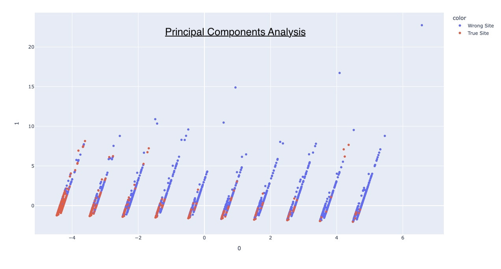
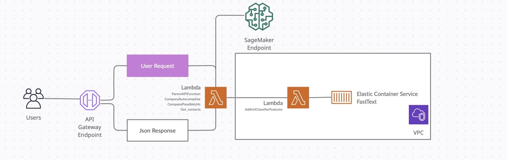

# Decentralized French Companies Register with ML/NLP

Easy Prospects is a CompanyToData API that returns publicly available data of a company. It takes as inputs the name of the company and a description of the activity in natural language and returns the website url and contact details (phone numbers, public emails, social networks) extracted from the website.

With many applications in B2B lead generation and B2B data enrichment, it provides a fully decentralized company register without the need of updating nor maintaining databases.


## Table of content

- [Installation](#installation)
- [Third Party APIs](#third-party-api)
  - [SIREN API](#api-siren)
  - [Bing Search API](#bing-search)
- [Data Flow](#data-flow)
- [Machine Learning](#ml-process)
  - [Feature Engineering](#feature-engineering)
  - [Model selection](#model-selection)
  - [Training](#training)
  - [Validation](#validation)
  - [Production](#production)
- [Data Extraction](#data-extraction)
- [AWS deployment](#AWS-deployment)
- [License](#license)
- [Links](#links)

<a id="installation"></a>

## Installation

You will find the entire code of the application in this directory, ready for AWS deployment. Check also the [AWS deployment](#AWS-deployment) section for more details.

<a id="third-party-api"></a>

## Third Party APIs

<a id="api-siren"></a>

### SIREN API

In 2018, the French administration INSEE opened the access to registered companies data through an API. We will be using two endpoints of this API :

- V1 Endpoint with key word search: `https://entreprise.data.gouv.fr/api/sirene/v1/full_text/key_word`

- V3 Endpoint with company ID search (SIREN): `https://entreprise.data.gouv.fr/api/sirene/v3/etablissements/?siren=SIREN`
This endpoint makes an exact with the unique identification number  `SIREN` and returns the related company data.

The data provided by the API (V1 and V3 endpoints) for each each company (json format) include:

- Unique identification number (SIREN)

- Company name
- Address
- Activity description code (over 732 categories)
- Activity description in natural language (french)

⚠️ Public version is limited to 7 requests / second. You can install your own version of the API [here](https://entreprise.data.gouv.fr/api_doc/sirene) if you need more requests.

<a id="bing-search"></a>

### Bing Search API

Official Bing Search API returns search results for a specific `query` (json format) :

- Url
- Url rank

- Language

- IsFamiliyFriendly

- Meta description in natural language

⚠️ It costs around 3-7 usd / 1000 requests. If you think about scraping search engines, it may work with stability and scalability issues. After spending some time on it, I would recommend to use Bing API instead.
<a id="third-party-api"></a>

## Data Flow

<br>


<a id="ml-process"></a>

## Machine Learning Model

<a id="feature-engineering"></a>

### Feature Engineering

We build a 8 dimensions vector for each search result in order to feed a non-linear binary classifier. We need to build the vector with metrics related to both search result and company.

- **Feature#1** : search rank
- **Feature#2** : language (1 for french, 0 for any other language)
- **Feature#3** : inverse normalized Levenshtein distance (edit distance) between the search url and the name of the company

`AddUrlClassifierFeatures/utils.py`

```python
def lev_score_url_with_txt(url, txt):
    url = url.lower()
    txt = txt.lower()
    dom = dom_name(url)
    dom = re.sub("[^0-9a-z]", '', dom)
    txt = re.sub("[^0-9a-z]", '', txt)
    score = 0
    lev_dist = int()
    m = min(len(dom), len(txt)) 
    lev_dist = LD(txt, dom)
    if m > 0:
        score = 1 - lev_dist/m # <= Feature#3
    return score
```

- **Feature#4** :  metric score related to the longest ngram in common in company name & url

`AddUrlClassifierFeatures/features_builder.py`

```python
def max_rs_n_gram_matching_dom(bing_result_dict):
    n = 0
    rs = bing_result_dict['company_name'].lower()
    n_rs = len(rs.split())
    url = bing_result_dict['url']
    n_grams = utils.get_all_n_grams(rs)
    dom = bing_result_dict['domain'].lower()
    dom = re.sub("[^0-9a-z]", "", dom)
    max_n = 0
    for n_gram in n_grams:
        n = len(n_gram)
        if ' '.join(n_gram) in dom:
           max_n = max(n, max_n)
    score = (math.exp(max_n) - 1)*(1- math.exp(-n_rs)) # <= Feature#4
    return score
```

- **Feature#5** : metric score related to the longest substring in common in company name & url

`AddUrlClassifierFeatures/features_builder.py`

```python
def max_len_string_match(bing_result_dict):
    rs = bing_result_dict['company_name'].lower()
    url = bing_result_dict['url'].lower()
    n = 0
    dom = bing_result_dict['domain'].lower()
    n = len(utils.longestSubstringFinder(dom, rs))
    if min(len(dom), len(rs)) > 0:
        score = n / min(len(dom), len(rs)) #<= Feature#5
    else:
        score = 0
    return score
```

- **Feature#6** : binary check if the company base city is included in the url (1 if the city is a substring of the url, 0 else)

- **Feature#7** : binary check if the company base department is included in the url (1 if the department number is a substring of the url, 0 else)
- **Feature#8** : cosine similarity score between the activity description sentence embedding and the meta description of the search result website

**Illustration :**

company_name : La Casa di Roma 

activity_description : Italian restaurant

<br>
candidate_url1 : lacasadiromapizza.fr

meta_description_1 : Get your hot pizza in less than 1 minute

<br>
candidate_url2 : bestromatravel.fr

meta_description_2 : Visit Roma next week-end

<br>


The sentence embedding is computed simply by averaging the word embedding of each word weighted by TF (Term-Frequency) in order to reduce the impact of frequent words after some minor text pre-processing.

`AddUrlClassifierFeatures/utils.py`

```python
def sentence_embedding(sent, tf=True):
    sent = sent.lower()
    batch = sent.split()
    batch = [re.sub("[^a-zäåçéñöüáàâãèêëíìîïóòôõú'ùû惜ÿ]", "", u)
             for u in batch]
    batch = [u for u in batch if word_frequency(u, 'fr') > 0 and len(u) > 2]
    freq = [word_frequency(u, 'fr') for u in batch]
    if len(batch) > 0:
        channel = grpc.insecure_channel(settings.FASTTEXT_URL)
        stub = spb2_grpc.FastTextStub(channel)
        request = spb2.VectorsRequest(
            model_name="cc.fr.300", batch=batch
        )
        response = stub.GetWordsVectors(request)
        embeddings = list()
        for i in range(len(batch)):
            a = str(response.vectors[i])
            a = a.replace('element: ', '')
            a = a.splitlines()
            if tf:
                a = [float(u)/freq[i] for u in a]
            else:
                a = [float(u) for u in a]
            embeddings.append(a)
        embeddings = np.array(embeddings)
        sent_embed = np.mean(embeddings, axis=0)
    else:
        sent_embed = np.zeros(300)   
    return sent_embed
```

<a id="model-selection"></a>

### Model selection

A fast PCA on our features shows that the data is likely to be not linearly separable. Sagemaker AutoML for model selection and tuning confirmed with XGBoost model selected with the best F1 score.


<a id="training"></a>

### Training

`https://github.com/mehdibennouna17/AI-NLP-EasyProspects/blob/main/SagemakerModel/bing-classifier-automl.ipynb`

```
bing-automl24-16-14-47mGiu2zG1Ie-014-adb23de8 {'MetricName': 'validation:f1_binary', 'Value': 0.8663600087165833}
659782779980.dkr.ecr.eu-west-3.amazonaws.com/sagemaker-xgboost:1.2-2-cpu-py3
```

<a id="validation"></a>

### Validation

Validation gives an F1-score of 90.4%   :smile:🏆

```
Accuracy: 0.9802603947921041
Precision: 0.9024390243902439
Recall: 0.9061224489795918
F1: 0.9042769857433809
Confusion Matrix: 
[[2112   24]
 [  23  222]]
 ```

<a id="production"></a>

### Production

`https://github.com/mehdibennouna17/AI-NLP-EasyProspects/blob/main/SagemakerModel/bing-classifier-automl.ipynb`

Before creating the endpoint, we modify environnement variables in order to predict both the label class and probability.

```python
timestamp_suffix = strftime("%d-%H-%M-%S", gmtime())
model_name = best_candidate_name + timestamp_suffix + "-model"
Containers=best_candidate["InferenceContainers"]
Containers[1]['Environment'].update({'SAGEMAKER_INFERENCE_OUTPUT': 'predicted_label, probability'})
Containers[2]['Environment'].update({'SAGEMAKER_INFERENCE_INPUT': 'predicted_label, probability'})
Containers[2]['Environment'].update({'SAGEMAKER_INFERENCE_OUTPUT': 'predicted_label, probability'})

```

Then, we create an endpoint with `ml.t2.medium` EC2 type.

```python
model_arn = sm.create_model(
    Containers=Containers,
    ModelName=model_name,
    ExecutionRoleArn=role
)

epc_name = best_candidate_name + timestamp_suffix + "-epc"
ep_config = sm.create_endpoint_config(
    EndpointConfigName=epc_name,
    ProductionVariants=[
        {
            "InstanceType": "ml.t2.medium",
            "InitialInstanceCount": 1,
            "ModelName": model_name,
            "VariantName": "main",
        }
    ],
)


ep_name = best_candidate_name + timestamp_suffix + "-ep"
create_endpoint_response = sm.create_endpoint(EndpointName=ep_name, EndpointConfigName=epc_name)
```

<a id="data-extraction"></a>

## Data Extraction

I will not detail here the extraction methods developed. Feel free to check the code in the corresponding files :

Email extractor : `Get_contacts/email_classifier_mod_light.py`

Phone numbers extractor: `Get_contacts/tel_classifier.py`

Linkedin extractor: `Get_contacts/linkedin_utils.py`

Facebook extractor : `Get_contacts/facebook_utils.py`

Instagram extractor : `Get_contacts/instagram_utils.py`

Youtube extractor : `Get_contacts/youtube_utils.py`

<a id="AWS-deployment"></a>

## AWS deployment

Here is a possible serverless architecture on AWS :



<a id="license"></a>

## License

The Easy Prospects API is licensed under the terms of the GPL Open Source
license and is available for free.

<a id="links"></a>

## Links
- [SIREN API](https://entreprise.data.gouv.fr/api_doc/sirene)
- [Bing Search API](https://www.microsoft.com/en-us/bing/apis/bing-web-search-api)
- [FastText](https://fasttext.cc)
- [FastText As A Service](https://github.com/nielsen-oss/fasttext-serving)
- [Source code](https://github.com/mehdibennouna17/AI-NLP-EasyProspects)
