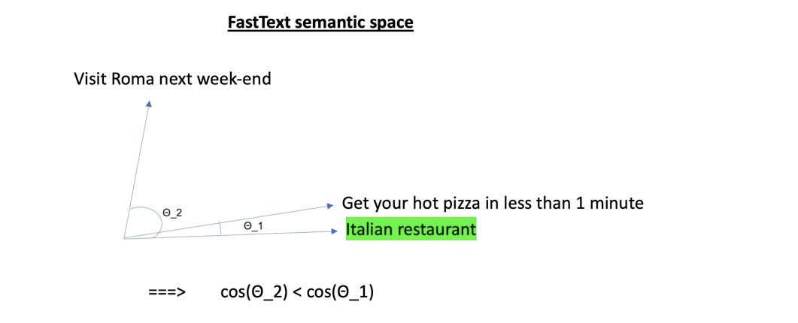

# Decentralized French Companies Register with AI/NLP


Easy Prospects is a CompanyToData API that returns publicly available data of a company. It takes as inputs the name of the company and a description of the activity in natural language and returns the website url and contact details (phone numbers, social networks urls) extracted from the website. 

With many applications in B2B lead generation and B2B data enrichment, it provides a fully decentralized company register without the need of updating / maintaining databases.


## Table of content

- [Installation](#installation)
- [Third Party API's](#thirs-party-apis)
    - [SIREN API](#api-siren)
    - [Bing Search API](#bing-search)
- [Data Flow](#data-flow)
- [Machine Learning Process](#ml-process)
    - [Feature Engineering](#Feature-engineering)
    - [Model Selection](#model-selection)
    - [Training](#training)
    - [Validation](#validation)
    - [Production](#production)
- [Data Extraction](#data-extraction)    
- [AWS deployment](#AWS-deployment)
- [License](#license)
- [Links](#links)

## Installation
You will find the entire code of the application in this directory, ready for AWS deployement. Check also the [AWS deployment](#AWS-deployment) section for more details. Feel free to send me an email if you have any question.

## Third Parties API's
### SIREN API
In 2018, the French administration INSEE opened the access to registered companies data through an API. We will be using two endpoints of this API : 

* V1 Endpoint with key word search: `https://entreprise.data.gouv.fr/api/sirene/v1/full_text/key_word`.
* V3 Endpoint with key word search: `https://entreprise.data.gouv.fr/api/sirene/v3/etablissements/?siren=SIREN`.
This endpoint makes an exact with the unique identification number  `SIREN` and returns the related company data.

The data provided by the API (V1 and V3 endpoints) for each each company (json format) :
* Unique identification number
* Company name
* Adress
* Activity description code (over 732 categories)
* Activity description in natural language (french)

⚠️ Public version imited to 7 requests / second. You can install your own version of the API [here](https://entreprise.data.gouv.fr/api_doc/sirene) if you need more requests. 


### Bing Search API
Official Bing Search API that returns search results for a specific `query` (json format) : 
* Url
* Url rank
* Language
* IsFamiliyFriendly
* Meta description in natural language

⚠️ It costs around 3-5 usd / 1000 requests. If you think about scraping search engines, it may work with stability and scalability issues. After spending some time on it, i would recommand to use Bing API instead. 

## Data Flow
<br>


## Machine Learning Model
### Feature Engineering
We build a 8 dimensions vector for each search result in order to feed a non-linear binary classifier. We need to build the vector with metrics related to both search result and company.
* **Feature#1** : search rank
* **Feature#2** : language (1 for french, 0 for any other language)
* **Feature#3** : inverse normalized Levenshtein distance (edit distance) between the search url and the name of the company

`AddUrlClassifierFeatures/utils.py`
```python
def lev_score_url_with_txt(url, txt):
    url = url.lower()
    txt = txt.lower()
    dom = dom_name(url)
    dom = re.sub("[^0-9a-z]", '', dom)
    txt = re.sub("[^0-9a-z]", '', txt)
    score = 0
    lev_dist = int()
    m = min(len(dom), len(txt)) 
    lev_dist = LD(txt, dom)
    if m > 0:
        score = 1 - lev_dist/m # <= Feature#3
    return score
```
* **Feature#4** :  metric score related to the longest ngram in common in company name & url

`AddUrlClassifierFeatures/features_builder.py`
```python
def max_rs_n_gram_matching_dom(bing_result_dict):
    n = 0
    rs = bing_result_dict['company_name'].lower()
    n_rs = len(rs.split())
    url = bing_result_dict['url']
    n_grams = utils.get_all_n_grams(rs)
    dom = bing_result_dict['domain'].lower()
    dom = re.sub("[^0-9a-z]", "", dom)
    max_n = 0
    for n_gram in n_grams:
        n = len(n_gram)
        if ' '.join(n_gram) in dom:
           max_n = max(n, max_n)
    score = (math.exp(max_n) - 1)*(1- math.exp(-n_rs)) # <= Feature#4
    return score
```
* **Feature#5** : metric score related to the longest substring in common in company name & url

`AddUrlClassifierFeatures/features_builder.py`
```python
def max_len_string_match(bing_result_dict):
    rs = bing_result_dict['company_name'].lower()
    url = bing_result_dict['url'].lower()
    n = 0
    dom = bing_result_dict['domain'].lower()
    n = len(utils.longestSubstringFinder(dom, rs))
    if min(len(dom), len(rs)) > 0:
        score = n / min(len(dom), len(rs)) #<= Feature#5
    else:
        score = 0
    return score
```
* **Feature#6** : binary check if the company base city is included in the url (1 if the city is a substring of the url, 0 else) 
* **Feature#7** : binary check if the company base department is included in the url (1 if the department number is a substring of the url, 0 else) 
* **Feature#8** : cosine similarity score between the activity description sentence embedding and the meta description of the search result website

**Illustration :** 

company_name : La Casa di Roma

activity_description : Italian restaurant

<br>
candidate_url1 : https://lacasadiromapizza.fr

meta_description_1 : Get your hot pizza in less than 1 minute

<br>
candidate_url2 : https://bestromatravel.fr

meta_description_2 : Visit Roma next week-end 

<br>




The sentence embedding is computed simply by averaging the word embedding of each word weighted by TF (Term-Frequency) in order to reduce the impact of frequent words after some minor text pre-processing.

`AddUrlClassifierFeatures/utils.py`

```python
def sentence_embedding(sent, tf=True):
    sent = sent.lower()
    batch = sent.split()
    batch = [re.sub("[^a-zäåçéñöüáàâãèêëíìîïóòôõú'ùû惜ÿ]", "", u)
             for u in batch]
    batch = [u for u in batch if word_frequency(u, 'fr') > 0 and len(u) > 2]
    freq = [word_frequency(u, 'fr') for u in batch]
    if len(batch) > 0:
        channel = grpc.insecure_channel(settings.FASTTEXT_URL)
        stub = spb2_grpc.FastTextStub(channel)
        request = spb2.VectorsRequest(
            model_name="cc.fr.300", batch=batch
        )
        response = stub.GetWordsVectors(request)
        embeddings = list()
        for i in range(len(batch)):
            a = str(response.vectors[i])
            a = a.replace('element: ', '')
            a = a.splitlines()
            if tf:
                a = [float(u)/freq[i] for u in a]
            else:
                a = [float(u) for u in a]
            embeddings.append(a)
        embeddings = np.array(embeddings)
        sent_embed = np.mean(embeddings, axis=0)
    else:
        sent_embed = np.zeros(300)   
    return sent_embed
```
### Model Selection
### Training
### Validation
### Production

## Data Extraction

## AWS deployment

## License

The Easy Prospects API is licensed under the terms of the GPL Open Source
license and is available for free.

## Links

* [SIREN API](https://entreprise.data.gouv.fr/api_doc/sirene)
* [Bing Search API](https://www.microsoft.com/en-us/bing/apis/bing-web-search-api)
* [FastText](https://fasttext.cc)
* [FastText As A Service](https://github.com/nielsen-oss/fasttext-serving)
* [Source code](https://github.com/mehdibennouna17/AI-NLP-EasyProspects)


xxxxxxxxxxxxxxxxxxxxxxxxxxxxxxxxxxxxxxxxxxxxxxxx


This document is for the latest Aimeos TYPO3 **21.10 release and later**.

- LTS release: 21.10 (TYPO3 10/11 LTS)

### Composer

**Note:** composer 2.1+ is required!

The latest version can be installed via composer too. This is especially useful if you want to create new TYPO3 installations automatically or play with the latest code. You need to install the composer package first if it isn't already available:

`php -r "readfile('https://getcomposer.org/installer');" | php -- --filename=composer`

In order to tell install TYPO3, you have to execute

`composer create-project typo3/cms-base-distribution myshop`

This will install TYPO3 into the `./myshop/` directory.

Then, change to the `./mshop/` directory and install the Aimeos extension for TYPO3 with:

`composer req aimeos/aimeos-typo3:~21.10`

This will install stable TYPO3 version and the latest Aimeos TYPO3 extension. If you want a more or less working installation out of the box for new installations, you should install the Bootstrap package too:

`composer req bk2k/bootstrap-package`

### TER extension

If you want to install Aimeos into your existing TYPO3 installation, the [Aimeos extension from the TER](https://typo3.org/extensions/repository/view/aimeos) is recommended. You can download and install it directly from the Extension Manager of your TYPO3 instance.

For new TYPO3 installations, there's a 1-click [Aimeos distribution](https://typo3.org/extensions/repository/view/aimeos_dist) available too. Choose the Aimeos distribution from the list of available distributions in the Extension Manager and you will get a completely set up shop system including demo data for a quick start.

## TYPO3 setup

Setup TYPO3 as normal by creating a `FIRST_INSTALL` file in the `./public` directory:

```bash
touch public/FIRST_INSTALL
```

Open the URL of your installation in the browser and follow the steps in the TYPO3 setup scripts.

### Database setup

If you use MySQL < 5.7.8, you have to use `utf8` and `utf8_unicode_ci` instead because those MySQL versions can't handle the long indexes created by `utf8mb4` (up to four bytes per character) and you will get errors like

```
1071 Specified key was too long; max key length is 767 bytes
```

To avoid that, change your database settings in your `./typo3conf/LocalConfiguration.php` to:

```
'DB' => [
    'Connections' => [
        'Default' => [
            'tableoptions' => [
                'charset' => 'utf8',
                'collate' => 'utf8_unicode_ci',
            ],
            // ...
        ],
    ],
],
```

### Security

Since **TYPO3 9.5.14+** implements **SameSite cookie handling** and restricts when browsers send cookies to your site. This is a problem when customers are redirected from external payment provider domain. Then, there's no session available on the confirmation page. To circumvent that problem, you need to set the configuration option `cookieSameSite` to `none` in your `./typo3conf/LocalConfiguration.php`:

```
    'FE' => [
        'cookieSameSite' => 'none'
    ]
```

### Composer

#### TYPO3 11

When using TYPO3 11, you have to run these commands from your installation directory:

```bash
php ./vendor/bin/typo3 extension:setup
php ./vendor/bin/typo3 aimeos:setup --option=setup/default/demo:1
```

If you don't want to add the Aimeos demo data, you should remove `--option=setup/default/demo:1` from the Aimeos setup command.

#### TYPO3 10

For TYPO3 10, these commands are required:

```bash
php ./vendor/bin/typo3 extension:activate scheduler
php ./vendor/bin/typo3 extension:activate aimeos
```

### TER Extension

* Log into the TYPO3 back end
* Click on ''Admin Tools::Extension Manager'' in the left navigation
* Click the icon with the little plus sign left from the Aimeos list entry (looks like a lego brick)


Afterwards, you have to execute the update script of the extension to create the required database structure:


## Site setup

TYPO3 10+ requires a site configuration which you have to add in "Site Management" > "Sites" available in the left navigation.

## Page setup

The page setup for an Aimeos web shop is easy if you import the example page tree for TYPO3 10/11:

* [21.10+ page tree](https://aimeos.org/fileadmin/download/Aimeos-pages_21.10.t3d) only

**Note:** The Aimeos layout expects [Bootstrap](https://getbootstrap.com) providing the grid layout!

### Go to the import view

* In Web::Page, root page (the one with the globe)
* Right click on the globe
* Move the cursor to "Branch actions"
* In the sub-menu, click on "Import from .t3d"


### Upload the page tree file

* In the page import dialog
* Select the "Upload" tab (2nd one)
* Click on the "Select" dialog
* Choose the file you've downloaded
* Press the "Upload files" button


### Import the page tree

* In Import / Export view
* Select the uploaded file from the drop-down menu
* Click on the "Preview" button
* The pages that will be imported are shown below
* Click on the "Import" button that has appeared
* Confirm to import the pages


Now you have a new page "Shop" in your page tree including all required sub-pages.

### SEO-friendly URLs

TYPO3 9.5 and later can create SEO friendly URLs if you add the rules to the site config:
[https://aimeos.org/docs/latest/typo3/setup/#seo-urls](https://aimeos.org/docs/latest/typo3/setup/#seo-urls)

